# BootTrack - Bootcamp Progress Tracking App

## General Assembly Project Three

We were tasked with producing a full-stack application as a team of three. We completed this in week 8 and 9 of our Software Engineering Immersive. We were given free reign on the topic of our project, and together with my group we decided to write an application to show class notes, progress and provide an overview of homework submissions for the user. I was the project manager for this project. 

### Deployment link

<https://boot-track.herokuapp.com/> - Deployed project

<https://github.com/hannahbodey/Project-3> - Git repo

### Timeframe & Working Team

We completed this project in weeks 8 and 9 of the course, with 8 working days in total given to this project. We worked as group of three, and my collaborators were: 

Neya Omar <https://github.com/NeyaOmar> 

Ali Abed-Ali <https://github.com/AbedHubQA> 

### Technologies Used

*Back End:*

-Mongoose

-MongoDB

-Nodemon

-Bcrypt

-JSON web tokens

*Front End:*

-JavaScript

-React

-HTML

-CSS

-Sass

*Development Tools:*

-Excalidraw

-Trello

### Brief

- Build a full-stack application by making your own backend and your own front-end
- Use an Express API to serve your data from a Mongo database
- Consume your API with a separate front-end built with React
- Be a complete product which most likely means multiple relationships and CRUD functionality for at least a couple of models
- Implement thoughtful user stories / wireframes that are significant enough to help you know which features are core MVP and which you can cut
- Have a visually impressive design

### Planning

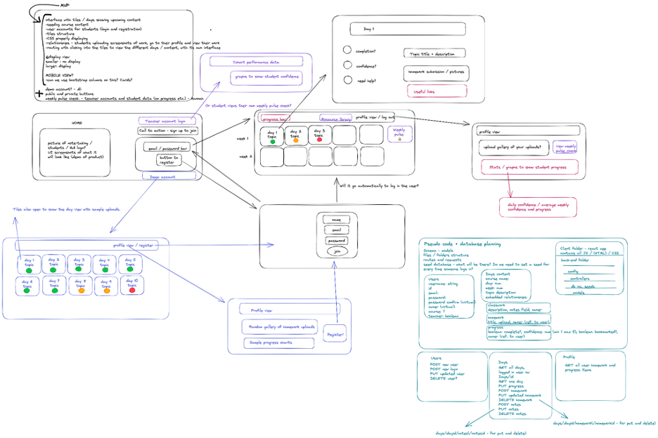

We began by detailing our minimum viable product, thinking through each of the elements involved:

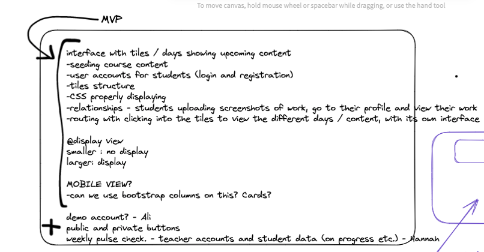

We visualised the UX of this project, using black for all MVP items and colour for each extra element. These were also colour coded based on who might take those elements of the project once we had completed the MVP.  

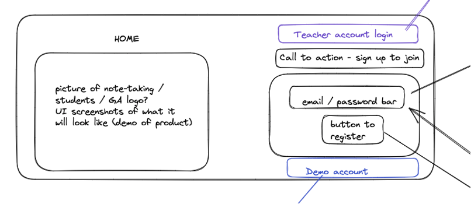

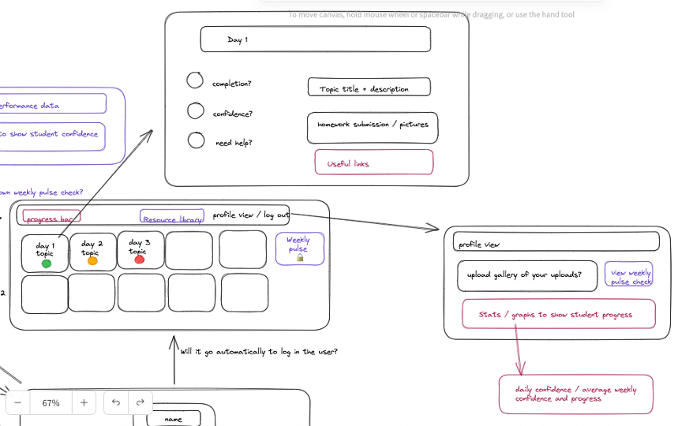

To view the whole wireframe, including bonus elements, please click on the wireframe.png inside our project. It will then be possible to view the below at a slightly larger scale: 

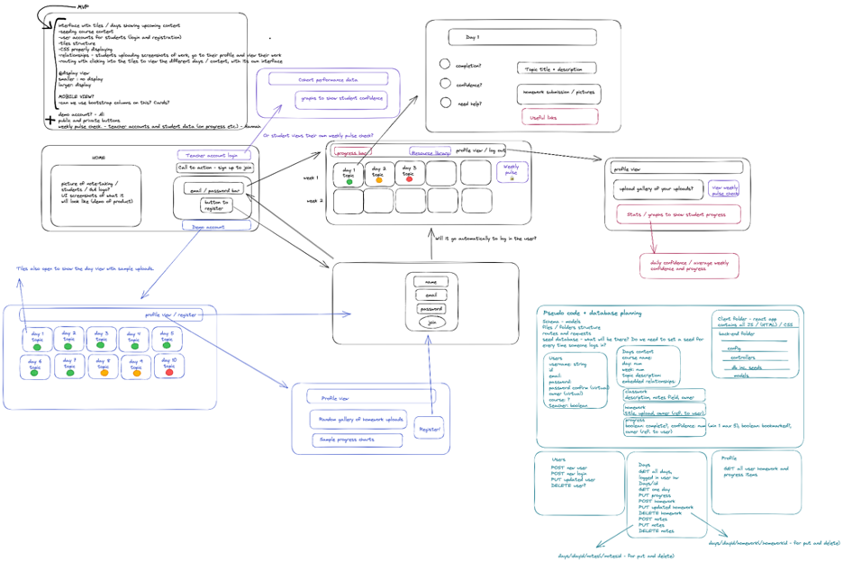

We also planned our back-end and the various connecting features that would be necessary, including embedded relationships, for example. 

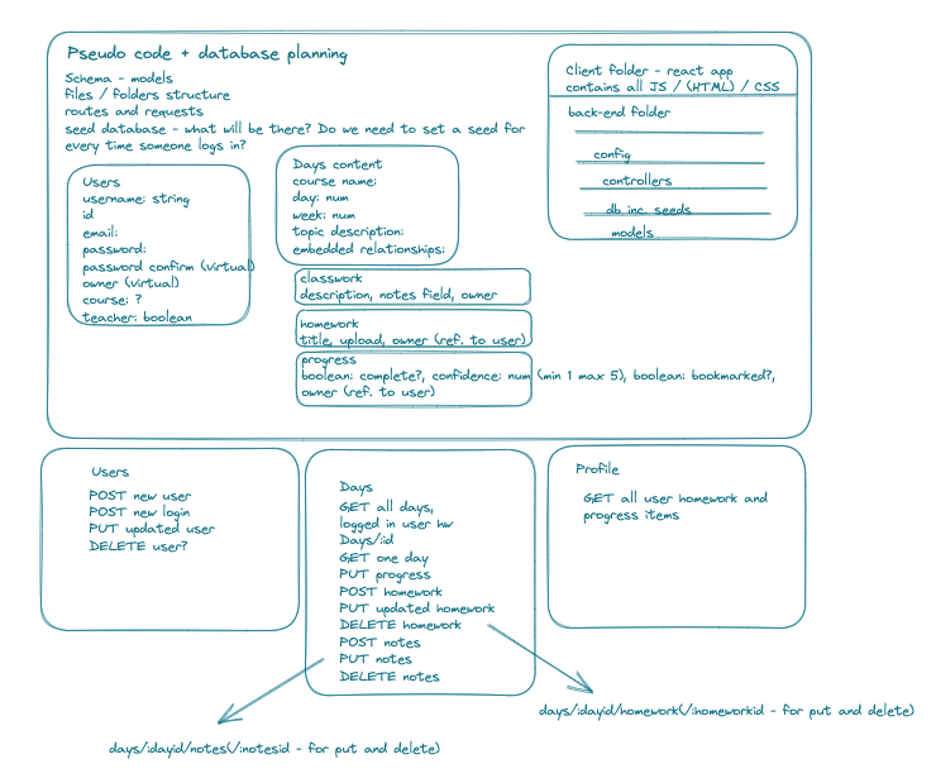

We also identified the best ways to work together, including daily task lists and itemised elements for completion:

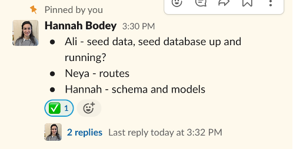

As the project developed, I modified this to be based on a trello board, in place of these daily lists:

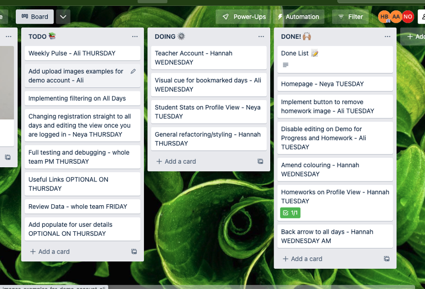

### Build / Code Process

I built the schema for our data, and established them as models. I did this for both the User schema and the Days schema - both of these involved various relationships. In the User schema, I also incorporated the bcrypt encryption, for the User. 

The Days schema has multiple embedded relationships - any one user can make a new homework upload, for example. The User then a reference relationship to the owner key on each of those individual homework / classwork uploads; any one student user shouldn’t be able to own a ‘day’, since this is populated based on their course, and they should also only be able to submit one, for example, progress report, per day. 

We then used these reference relationships to populate the username on a student account so that a teacher can view a particular student’s progress overview. This data was also used to allow a teacher to filter to view one student’s overview. 

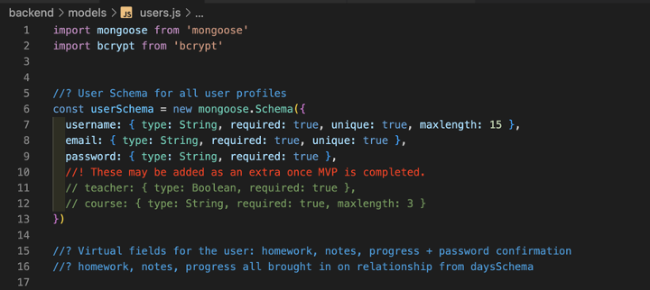

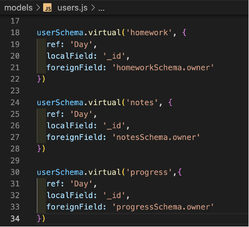

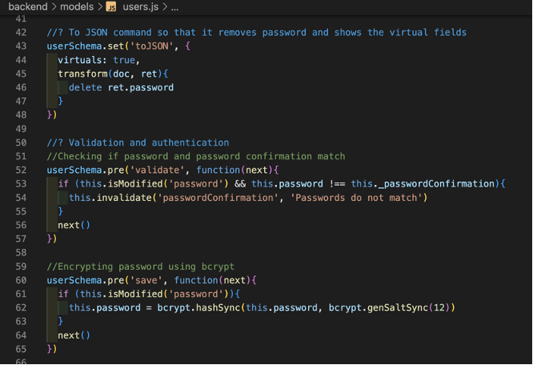

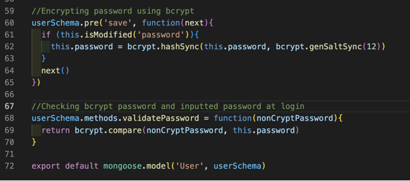

Here’s an excerpt from the Days schema:

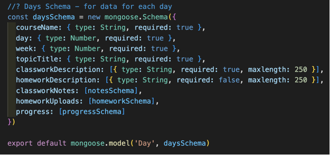

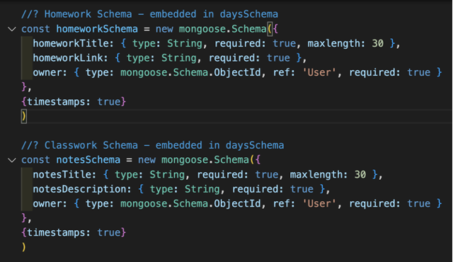

I also implemented the decrypting of this on the front-end, and was particularly pleased to include an additional element in the token payload so that I could identify users as teachers or not, and use that to allow them to view different pages. To do this, I added the logged in user, with all their data, to the req so that it would be passed down for use in each individual controller function (these screenshots were all taken in the development stage, hence the presence of console logs):

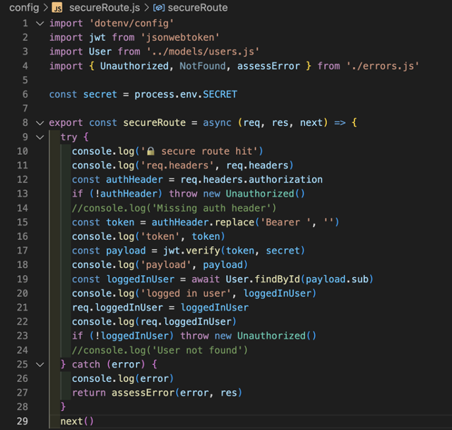

I implemented functions that could be exported and used on each page in order to decrypt the JSON web token and ensure that the user could be identified as authenticated and as a teacher wherever that was required:

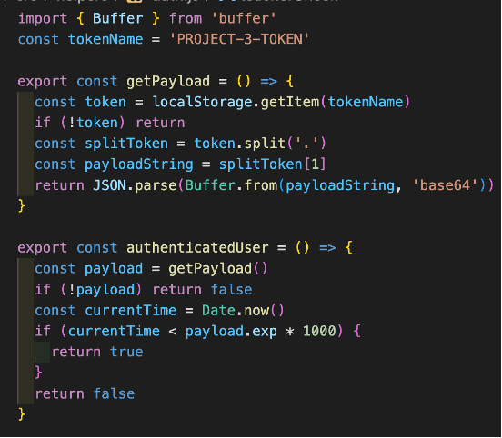

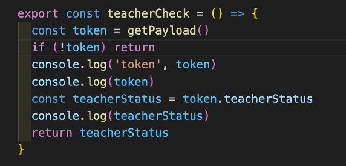

For both authenticatedUser() and teacherCheck(), I returned a boolean value, such that I could use these in ternary statements to determine what should be shown to the user, like the below for the nav bar:

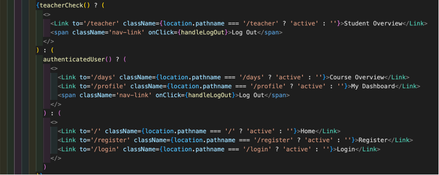

Another element of the project with which I was particularly pleased was the implementation of a slideshow on the home page. I looked on Google for various suggestions of how to do this, and then looked at my data to see how it could fit. I ended up using a setInterval to change the picture every 5 seconds, with state being changed on that interval to change the class name on the different divs containing the pictures. I then set a no-display for any div that was not considered ‘active’, thereby ensuring that only one image at a time showed:

### Challenges

Although there were some technical challenges, in terms of figuring out exactly how to show the bits of data required (of which I will give one example below), the biggest challenge during this project was project management. I noted above that I moved to using Trello partway through to help support the team - this was because one member of the team was unwell and was not always able to follow what we were working on. In an attempt to further include them, I implemented this tool, but ultimately they pulled out of the project with minimal notice for the two of us remaining. This meant that the biggest challenge was purely getting everything that we had planned to do (when thinking that there would be three team members) done, and still having extra features on our project that we were keen to include to enhance it.

One particular technical challenge was implementing the filter select option box for the teacher to view the progress of different students. This required quite a lot of trial and error of logic as I tried to work through each day and identify the owner of the e.g. homework upload on that day. Given that the homework uploads became an array of objects on these days, each with a different owner, it took some digging down to isolate the owner and ensure that there were no duplicate owners listed:

### Wins

I was very pleased to include the teacher account, which allows you to view an overview of the students’ progress. This was an additional feature beyond our MVP that I particularly wanted to implement, as I felt it would strongly enhance our product and raise it more to be something that would actually be attractive for use. Given our loss of a team member, it was a real push to get this in, and problems arose (like the one mentioned above) whilst I was creating it which made it quite challenging.

### Key Learnings and Takeaways

I really enjoyed being able to work on both the front and back end together. It was very helpful to see how careful design of the database would significantly enhance the ability to manipulate that data with ease on the front end. In future, I think I would pay even more attention to this, given that the difficulties experienced in extracting individual usernames for the teacher page discussed above became quite challenging, and I think that this could have been somewhat mitigated with further thought or foresight with the database.

### Bugs

When filtering for different users as a teacher on the select menu, teachers are also listed. We ran out of time to finish amending this.

### Future Improvements

In the future, I think that it would be excellent to include a graphical representation for both the student and teacher of their overall confidence / progress. For the teacher, this could then be twinned to include graphical overviews for the whole class. For example, they could see multiple pie charts indicating student progress or confidence. To add this, we would need to be able to state the courses to which the student was subscribed. It would also be excellent to add the ability to show multiple different courses or classes.

In addition, it would be good to introduce additional steps for registering users who want to register as teachers. Currently, a student, by responding ‘yes’ to  ‘are you a teacher?’, could access a teacher account. 
